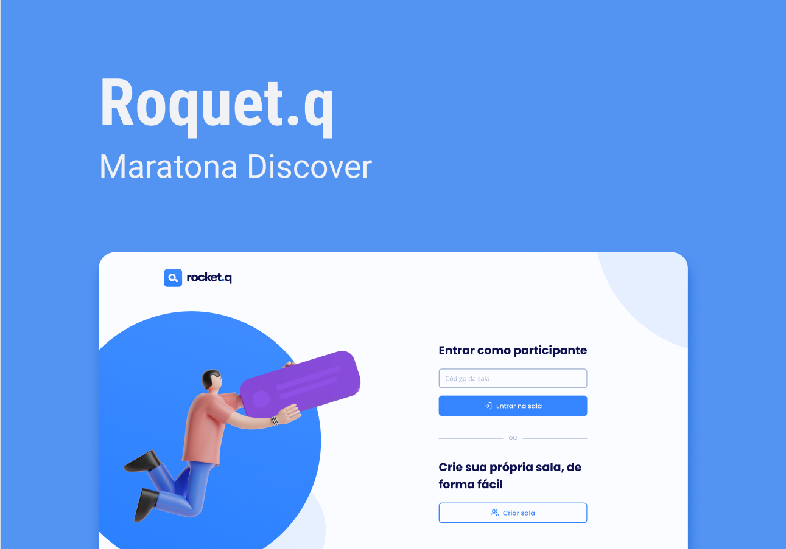

<h1 align="center">
  
</h1>

  <a href="#-tecnologias">Tecnologias</a>&nbsp;&nbsp;&nbsp;|&nbsp;&nbsp;&nbsp;
  <a href="#-projeto">Projeto</a>&nbsp;&nbsp;&nbsp;|&nbsp;&nbsp;&nbsp;
  <a href="#-layout">Layout</a>&nbsp;&nbsp;&nbsp;|&nbsp;&nbsp;&nbsp;
  <a href="#-instalação">Instalação</a>&nbsp;&nbsp;&nbsp;|&nbsp;&nbsp;&nbsp;
  <a href="#memo-licença">Licença</a>

 

  

 

  

## 🚀 Tecnologias

Esse projeto foi desenvolvido com as seguintes tecnologias:

- HTML
- CSS
- JavaScript
- NodeJS
- EJS
- Express
- SQLite

## 💻 Projeto

O Rocket.Q é uma aplicação de interação através de perguntas, sendo possível criar uma sala para internautas anônimos fazerem perguntas e o criador da sala em posse de uma senha gerenciar essas perguntas e marcar como lidas.

## 🔖 Layout

Você pode visualizar o layout do projeto através [desse link](https://www.figma.com/file/vp3iFfd1ohCbHyDX9jCiQi/Roquet.q). É necessário ter conta no [Figma](https://figma.com) para acessá-lo.

## 👨‍💻 Instalação

Você precisa ter o Node.js instalado na sua máquina. Senão tiver você pode fazer o download através desse link. Com o Node instalado na máquina, vc precisa apenas de 3 comandos (no terminal) na pasta do projeto, nessa ordem:

npm install -> Para instalar as dependências do projeto. (só precisa ser executado uma vez)
npm init-db -> Para criar o banco de dados local. (só precisa ser executado uma vez, mas se apagar o arquivo .sqlite terá que executar novamente)
npm start -> Para iniciar o servidor local (para acessar o projeto via navegador, digite na barra de endereço: localhost:3000)

## :memo: Licença

Esse projeto está sob a licença MIT. Veja o arquivo [LICENSE](.github/LICENSE.md) para mais detalhes.

